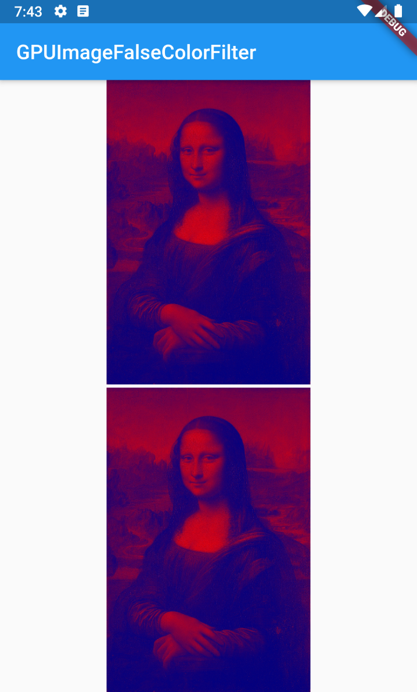

# Core Image and GPUImage filters package for Flutter 

A flutter package for iOS and Android for applying filter to image and video. Support all filters from Core Image on iOS.

## Installation

Add `native_filters` package as a [dependency in your pubspec.yaml file](https://flutter.io/platform-plugins/).

### iOS

No additional configuration required, the plugin work out of the box.

### Android

No additional configuration required, the plugin work out of the box.

### Example

``` dart
import 'dart:io';
import 'dart:typed_data';

import 'package:flutter/cupertino.dart';
import 'package:flutter/foundation.dart';
import 'package:flutter/material.dart';
import 'package:native_filters/native_filters.dart';
import 'package:path_provider/path_provider.dart';
import 'package:uuid/uuid.dart';

void main() => runApp(new MaterialApp(home: MyApp()));

class MyApp extends StatefulWidget {
  @override
  State<StatefulWidget> createState() => _MyAppState();
}

class _MyAppState extends State<MyApp> {
  final _filtersFactory = const FilterFactory();
  Filter _filter;
  File _output;
  Uint8List _data;

  String get asset => 'images/test.jpg';

  @override
  void initState() {
    super.initState();
    _prepare().then((_) => setState(() {}));
  }

  Future<void> _prepare() async {
    final directory = await getTemporaryDirectory();
    final uuid = Uuid();
    final path = '${directory.path}/${uuid.v4()}.jpg';
    if (defaultTargetPlatform == TargetPlatform.iOS) {
      _filter = await _filtersFactory.create('CIPhotoEffectMono');
    }
    if (defaultTargetPlatform == TargetPlatform.android) {
      _filter = await _filtersFactory.create('GPUImageFalseColorFilter');
    }
    await _filter?.setAssetSource(asset);
    _output = File(path);
    await _filter?.export(_output);
    _data = await _filter?.binaryOutput;
  }

  @override
  void dispose() {
    _filtersFactory.dispose(_filter);
    super.dispose();
  }

  @override
  Widget build(BuildContext context) {
    return Scaffold(
      appBar: AppBar(
        title: Text(_filter?.name ?? 'Initializing...'),
      ),
      body: Center(
        child: _output == null
            ? CircularProgressIndicator()
            : Column(
                children: <Widget>[
                  Expanded(
                    child: imagePreview1,
                  ),
                  SizedBox(height: 3),
                  Expanded(
                    child: imagePreview2,
                  )
                ],
              ),
      ),
    );
  }

  Widget get imagePreview1 {
    if (_output != null) {
      return Image.file(_output);
    }
    return Text('Failed to process and save image');
  }

  Widget get imagePreview2 {
    if (_data != null) {
      return Image.memory(_data);
    }
    return Text('Failed to process image');
  }
}
```

### Previews




## Getting Started

This project is a starting point for a Flutter
[plug-in package](https://flutter.dev/developing-packages/),
a specialized package that includes platform-specific implementation code for
Android and/or iOS.

For help getting started with Flutter, view our 
[online documentation](https://flutter.dev/docs), which offers tutorials, 
samples, guidance on mobile development, and a full API reference.
